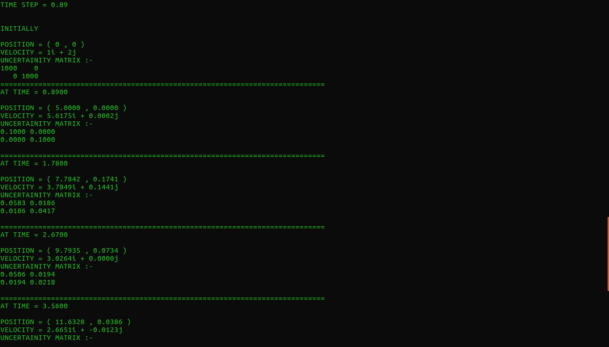
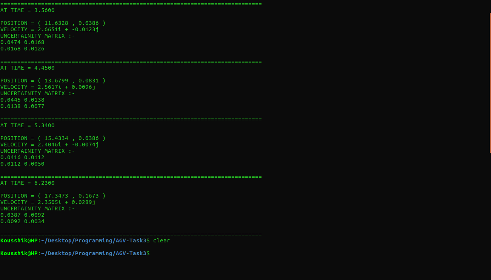

# AGV-Task3

This repository contains the codes and files related to the Task3 of AGV

This task is regarding localisation.

In this task we have to combine the bot's sensor inputs and its prior state to  give a more\
accurate reading.

## Given information

1.The bot is moving with a constant velocity.\
2.Initial position and velocity are given with a high uncertainity.\
3.A file with the bot's position as recorded by the sensors after a fixed time step.\
4.The uncertainity of the initial and the sensor data.\
5.The timestep after which each data is taken.\

## Applying Kalmann Filter

Let's say the given time step is dt , the initial state is X0, the initial uncertainity is P0.

Then without the sensor readings, X1 = F*X0 , where F operates on X such that based on its velocity and time step, it gets the next state.  

Therefore P1 = F * P0 \* F', where F' is F transpose

Let the sensor readings be Z1 and its uncertainity be R.

Let's define a matrix K = P*((P+R)^-1).

Combining the Gausians of both the sensor readings and the state derived from prior knowledge,

X1F = X1 + K*(X1 - Z1)

P1F = P1 - K*P1

where X1F is a state with a better accuracy than both the initial readings.

Now these act as the prior state for the next data. This process keeps on continuing untill the sensor readings are exhausted.

Each state is more and more accurate than the previous states.

## Running the program

First make sure you have Eigen library installed.

`sudo apt-get install libeigen3-dev`

Then

Clone the repo
`git clone https://www.github.com/thelethalcode/AGV-Task1.git`\

Cd into the directory
`cd AGV-Task3`

Compile the Task
`g++ Task3.cpp`

You have to enter the text file with the sensor readings as an command line argument. Another optional command line argument is the timestep. If it is not entered the program prompts the user to input it.

`./a.out Data1.txt 0.89`

You will be asked to input the bot's initial coordinates and velocity.

The program then prints the bot's positon, velocity and their uncertainity after every time step.

Output for time step = 0.89 s

